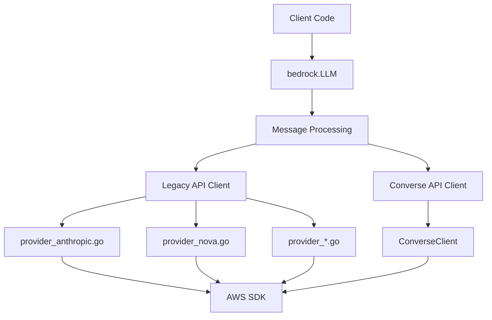
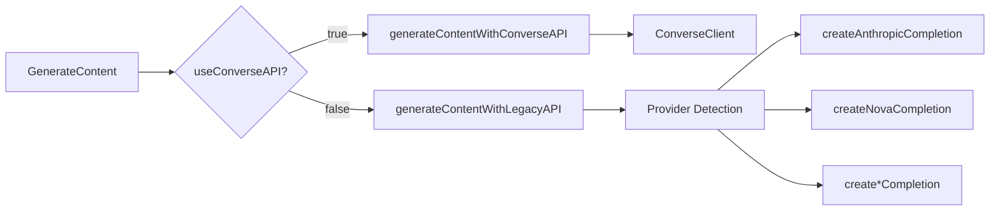
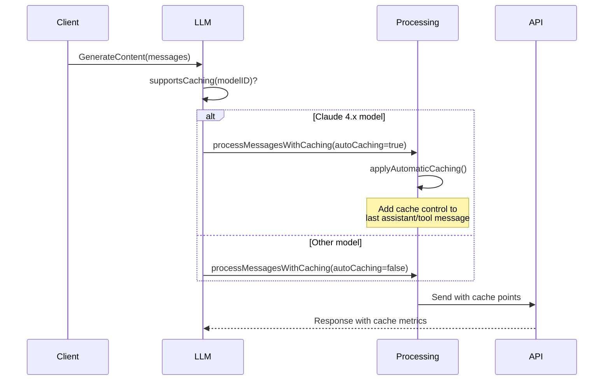
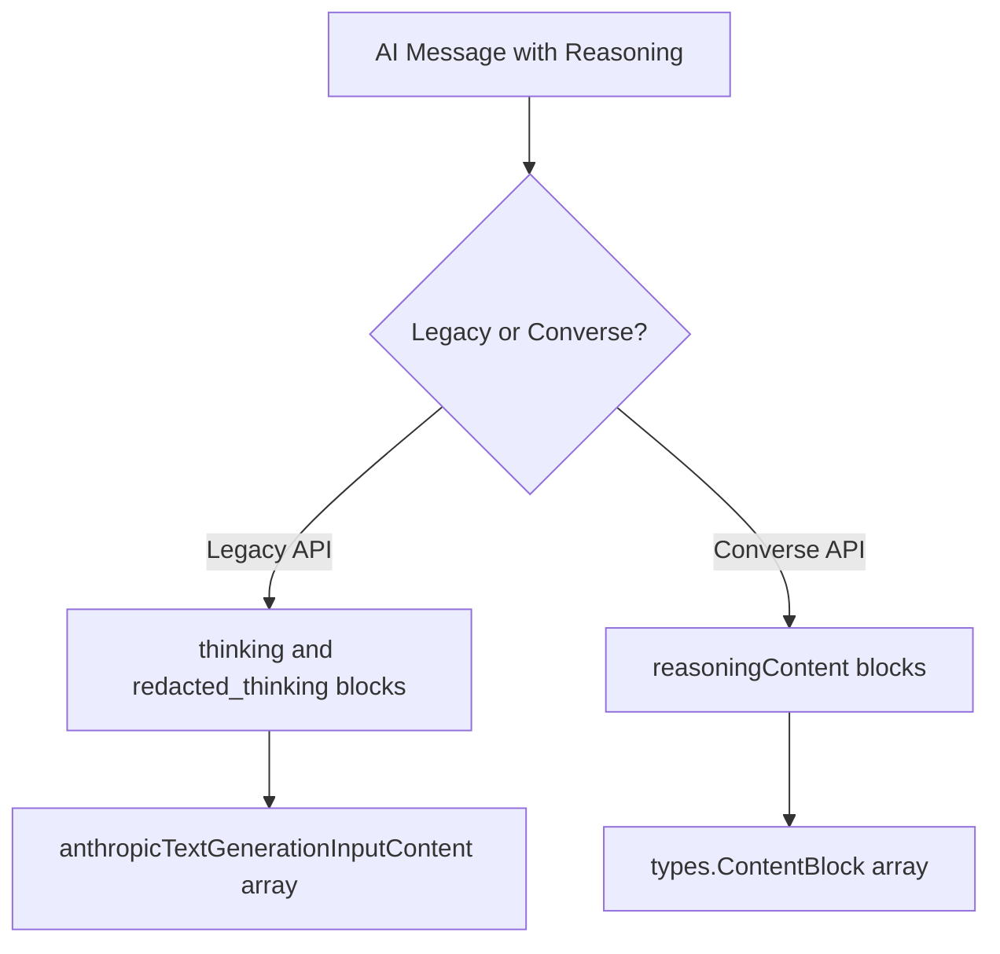
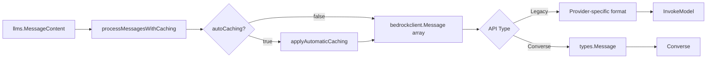

# AWS Bedrock LLM Provider

Production-ready Go client for AWS Bedrock with support for 40+ models across 11 providers (Amazon, Anthropic, Meta, DeepSeek, OpenAI, Qwen, Mistral, Moonshot, Z.AI, MiniMax, NVIDIA).

## Architecture Overview



### Three-Layer Design

**Why this architecture?**

1. **Public API Layer** (`bedrockllm.go`)
   - Single entry point: `bedrock.LLM`
   - Hides complexity of dual API support
   - Manages automatic caching logic

2. **Message Processing Layer** (`processMessages()`)
   - Converts `llms.MessageContent` → `bedrockclient.Message`
   - Handles tool calls, reasoning, multimodal content
   - Applies automatic cache control insertion

3. **Internal Client Layer** (`internal/bedrockclient/`)
   - Provider-specific implementations
   - AWS SDK interaction
   - Response parsing and streaming

## Dual API Strategy

### Why Two APIs?

**Legacy API** (InvokeModel/InvokeModelWithResponseStream):
- Direct access to model-specific features
- Anthropic cache_control format support
- Narrower model compatibility: seven provider families are implemented — ai21, amazon,
  nova, anthropic, cohere, meta and deepseek. Any other model id answers
  "unsupported provider" on this path
- **Use when**: a provider-specific field has no Converse equivalent

**Converse API** (Converse/ConverseStream):
- Unified interface across all models
- Native cachePoint support (AWS SDK types)
- Better error handling
- **Use when**: Building new applications (recommended)

**Decision Point**: `useConverseAPI` flag in `LLM` struct



## Automatic Prompt Caching

### How It Works

**Challenge**: Anthropic's prompt caching requires manual cache control wrappers on client side.

**Solution**: Automatic cache point insertion for Claude 4.x and 5.x models.



**Implementation**:
- `supportsCaching()`: Pattern matching on model ID (`claude-opus-4`, `claude-sonnet-4`,
  `claude-haiku-4`, `claude-opus-5`, `claude-sonnet-5`, `claude-haiku-5`, `claude-fable-5`,
  `claude-mythos-5`)
- `applyAutomaticCaching()`: Adds `CacheControl{Type: "ephemeral", TTL: "5m"}` to last cacheable message (assistant or tool response)
- **Why last message?** Caches conversation history before new user input
- **TTL Options**: 5 minutes (default) or 1 hour (configurable via `EphemeralCacheOneHour()`)

**Benefits**:
- 90% cost reduction on cached tokens  
- Zero client code changes with automatic caching
- Works with both Legacy and Converse APIs
- Supports both manual (`WithCacheControl()`) and automatic (`WithAutomaticCaching()`) modes

## Tool Calling Implementation

### Provider-Specific Differences

**Why different implementations?**

Different providers use different formats for tool inputs in Converse API:

| Provider | Input Format | Handled By |
|----------|-------------|------------|
| Anthropic | Native JSON objects | `map[string]any` direct |
| Nova | Native JSON objects | `map[string]any` direct |
| Qwen / Mistral / MiniMax / Nemotron | Native JSON objects | `map[string]any` direct |
| GLM (Z.AI) | **String-based** | Not supported |

**Problems with specific models**:
- **GLM (Z.AI)**: Backend expects tool input as string, not JSON object. This breaks Converse API spec.
- **Meta Llama 3.3/3.1 70B/8B**: Unstable behavior when processing tool call results.
- **Mistral Magistral Small**: Tool calling not supported.
- **Moonshot Kimi K2-Thinking**: Unstable tool calling behavior in streaming mode.
- **Qwen3-VL**: Unstable tool calling in streaming mode.

**Solution**: Models with backend issues or instability are excluded from tool calling tests.

### convertToolCallInput() Logic

**Why this function exists?**

AWS SDK requires Smithy-compatible types for `document.NewLazyDocument()`. Standard Go types from `json.Unmarshal` aren't always compatible.

```go
func convertToolCallInput(args any) (any, error) {
    // 1. Check Smithy compatibility (structs with `document` tags)
    if isSmithyValidObject(args) {
        return args, nil
    }
    
    // 2. Re-encode to normalize types for Smithy SDK
    // Uses UseNumber() to preserve numeric precision during JSON roundtrip
    jsonBytes := bytes.NewBuffer(nil)
    json.NewEncoder(jsonBytes).Encode(args)
    
    decoder := json.NewDecoder(jsonBytes)
    decoder.UseNumber()  // Preserves large numbers accurately
    
    var jsonValue any
    decoder.Decode(&jsonValue)
    return jsonValue, nil
}
```

**Why UseNumber()?**

Preserves numeric precision for large integers that might overflow float64. The `json.Number` type is properly handled by Smithy SDK's document encoding.

### Document Marshal for Tool Responses

**Why `MarshalSmithyDocument()`?**

When extracting tool call from response, `block.Value.Input` is `document.LazyDocument`, not plain Go type:

```go
// WRONG: json.Marshal on document - loses type info
argsJSON, _ := json.Marshal(block.Value.Input)  

// CORRECT: Use MarshalSmithyDocument to get JSON bytes directly
argsJSON, err := block.Value.Input.MarshalSmithyDocument()
if err != nil {
    return fmt.Errorf("failed to marshal tool input: %w", err)
}
// argsJSON is now []byte with the JSON representation
```

## Reasoning (Thinking) Support

### Models Supporting Reasoning

A reasoning request only reaches the wire for families that have a thinking
configuration on this platform. The rest carry nothing.

**Converse API** — a thinking configuration is sent for:
- Claude: Fable 5, Opus 5/4.8/4.7/4.6/4.5, Sonnet 5/4.6/4.5, Haiku 4.5 — `thinking`
  in `additionalModelRequestFields`, adaptive or budget (see below)
- Amazon Nova 2 Lite — `reasoningConfig` in `additionalModelRequestFields`.
  Nova 2 Pro, Micro and Sonic do not get it
- xAI Grok 4.x — `reasoning.effort` in `additionalModelRequestFields`
- OpenAI GPT OSS 120B and 20B — `reasoning_effort` in `additionalModelRequestFields`

**Legacy API** (InvokeModel) — a thinking configuration is sent for:
- Claude: Fable 5, Opus 5/4.8/4.7/4.6/4.5, Sonnet 5/4.6/4.5, Haiku 4.5 — `thinking` in the
  Anthropic body
- Amazon Nova 2 Lite — `reasoningConfig` inside `inferenceConfig`

**Reasoning models that take no configuration here**: Moonshot Kimi K2-Thinking,
MiniMax M2/M2.1/M2.5, DeepSeek R1, NVIDIA Nemotron 3 Super, Qwen3 32B, Magistral
Small. AWS documents no reasoning field for them, so a `WithReasoning` call on them
changes nothing on the wire.

**Z-AI GLM 4.7/4.7 Flash/5** are not reasoning models here: their AWS model cards
document neither reasoning nor a field that controls it, `ReasoningSupportFor`
reports them as not reasoning, and a `WithReasoning` call on them changes nothing
on the wire.

**How the wire shape is resolved**

Claude thinking is not a single flag — the generation resolves adaptive vs. budget
thinking from the model via the shared `llms/reasoning` capability tables (the same
source of truth used by the first-party Anthropic provider):

- **Adaptive-only** (Opus 4.7/4.8/5, Sonnet 5, Fable 5): `thinking.type=adaptive` +
  `output_config.effort`; budget thinking and sampling params are rejected. Bedrock
  serves `xhigh` on Opus 5 only and `max` on Opus 5, Opus 4.6 and Sonnet 4.6; a higher
  effort on any other Claude model is lowered to the top level it takes, with a warning. Opus 5,
  Sonnet 5, and Fable 5 think by default (Opus 5 is a breaking change from Opus 4.8,
  which defaults off). `WithReasoningDisabled()` sends `thinking.type=disabled` to
  Opus 5 and Sonnet 5 and no effort beside it; Fable 5 cannot be disabled. Opus 4.7/4.8
  default off, so omitting thinking already yields off.
- **Adaptive + budget** (Opus 4.6, Sonnet 4.6): either mechanism; caller preference honored.
- **Budget-only** (Opus 4.5, Sonnet 4.5, Haiku 4.5): `thinking.type=enabled` +
  `budget_tokens`. Opus 4.6 and Sonnet 4.6 also carry `output_config.effort` on
  this path; Opus 4.5 accepts it on the first-party API but rejects it here, so
  this door does not send it.

Nova 2 carries `type` plus `maxReasoningEffort` (low/medium/high) on both paths, and
its top effort clears `maxTokens`, `temperature` and `topP`, which Nova refuses
beside it. Grok carries an effort and nothing else. GPT OSS carries only
`reasoning_effort`: `low`, `medium` or `high`; `minimal` rises to `low`, `xhigh` and
`max` fall to `high`. `WithReasoningDisabled()` returns a typed
`ErrReasoningOffUnsupported` for a model whose thinking cannot be turned off, such as
Fable, Mythos, GPT OSS or DeepSeek R1.

## Structured Output

The provider-neutral `llms.WithStructuredOutput` is supported on both API paths for
the Claude models Bedrock serves it for — Opus 4.6 and 4.5, Sonnet 4.6 and 4.5, Haiku
4.5; any other Claude model returns a typed `ErrStructuredOutputUnsupported` before
the request. On the Converse API the other families get it only where their AWS model
card lists structured outputs — among them DeepSeek V3.1 and V3.2, GPT OSS, Qwen3,
Mistral Large 3, GLM, Kimi, MiniMax and Nemotron. Nova, Llama and every model whose
card is silent return the same typed error. The final response is guaranteed to be a
single JSON value
matching the supplied JSON Schema (Draft 2020-12), validated locally against the
original schema.

```go
schema := json.RawMessage(`{
    "type": "object",
    "properties": {"country": {"type": "string"}, "capital": {"type": "string"}},
    "required": ["country", "capital"],
    "additionalProperties": false
}`)

resp, err := llm.GenerateContent(ctx, messages,
    llms.WithStructuredOutput(llms.StructuredOutputConfig{Name: "capital", Schema: schema}))
```

**Wire mapping**:
- **Converse**: native `OutputConfig.TextFormat` with a `JsonSchemaDefinition` (AWS SDK types). Rides both `Converse` and `ConverseStream`.
- **Legacy (InvokeModel)**: Anthropic-compatible `output_config.format`, merged with reasoning `output_config.effort` when both are set.

**Requirements and behavior**:
- Every object node must set `additionalProperties: false` — Bedrock rejects a schema that omits it. The SDK enforces this locally with a typed `ErrStructuredOutputConfig` before the request is sent.
- Only Anthropic models are supported on the legacy path; a non-Anthropic legacy model returns a typed unsupported-path error. Converse is not restricted to Claude — a model whose AWS model card lists Structured Outputs gets it; any other returns the typed unsupported error.
- Only the final normal turn (`end_turn`/`stop_sequence`) is validated; a `tool_use`/`max_tokens`/guardrail/filtered turn is not treated as final JSON.
- The response `StopReason` is surfaced on `ContentChoice.StopReason` (Converse now transfers it from the response/`MessageStopEvent`).

**Why these models?**

Extended thinking/reasoning capabilities are model-specific features. OpenAI OSS, Moonshot and MiniMax models provide reasoning through the Converse API, while Anthropic models support both APIs.

### Message Structure with Reasoning



**Why order matters?**

A response can carry several reasoning blocks, each signed on its own, with encrypted
blocks among them, and the vendor wants the blocks of the last assistant turn back
unchanged and in its order. Both paths put every block back where the vendor put it:
the blocks that came before any tool call open the turn, and a block that followed a
tool call follows that call again.

### Signature Preservation

Every block keeps its own signature. `reasoning.ContentReasoning` carries the blocks in
`Blocks`, in the vendor's order; a reasoning made of a single unencrypted block that came
before any tool call keeps the classic `Content` and `Signature` fields instead.
`Sequence()` reads both shapes. `Content` joins
the readable text of every block for display and is not what travels back when `Blocks`
is set, so hand the reasoning back as it came:

```go
// Receive: every block with its signature and place
for _, block := range choice.Reasoning.Sequence() {
    _ = block.Signature
}

// Send back
llms.TextPartWithReasoning(choice.Content, choice.Reasoning)
```

## Message Processing Pipeline



### Key Transformations

**llms.MessageContent → bedrockclient.Message**:
- Role mapping (System/Human/AI/Tool → provider format)
- Content type detection (Text/Binary/ToolCall/ToolResponse)
- Reasoning extraction and formatting
- Cache control attachment

**bedrockclient.Message → AWS Request**:
- Legacy: JSON serialization with provider schemas
- Converse: AWS SDK types with document encoding

## Adding New Models

### Step-by-Step Process

1. **Add Model Constant** (`models_list.go`)
```go
// Include: Description, max tokens, languages, use cases
ModelNewProvider = "provider.model-id"
```

2. **Update Provider Detection** (if new provider)
```go
// bedrockclient.go
case strings.Contains(modelID, "newprovider"):
    return "newprovider"
```

3. **Implement Provider** (`internal/bedrockclient/provider_new.go`)
```go
func createNewProviderCompletion(ctx, client, modelID, messages, options) {
    // 1. Convert messages to provider format
    // 2. Build request payload
    // 3. Call InvokeModel
    // 4. Parse response
    // 5. Return llms.ContentResponse
}
```

4. **Register in Switch** (`bedrockclient.go`)
```go
case "newprovider":
    return createNewProviderCompletion(...)
```

5. **Add Tests** (`bedrockllm_test.go`)
- Add model to `TestAmazonOutputConverseAPI` models list (if Converse API supported)
- Add model to `TestAmazonOutputLegacyAPI` models list (Legacy API)
- Add model to `TestAmazonStreamingOutputConverseAPI` (if streaming supported)
- Add model to `TestAmazonStreamingOutputLegacyAPI` (if streaming with Legacy API supported)
- Add model to `TestAmazonToolCallingConverseAPI` (if tools supported)
- Add model to `TestAmazonToolCallingLegacyAPI` (if tools with Legacy API supported)
- Add model to `TestAmazonReasoningConverseAPI` (if reasoning/thinking supported)
- Add model to `TestAmazonReasoningLegacyAPI` (if reasoning with Legacy API supported)
- Structured output is covered by `TestAmazonStructuredOutputConverseAPI` and `TestAmazonStructuredOutputStreamingConverseAPI` (Converse); schemas must set `additionalProperties:false`

6. **Record HTTP Interactions**
```bash
HTTPRR_RECORD=. go test -v -run TestNewModel
```

### Provider Implementation Checklist

- [ ] Input struct with all parameters (Temperature, TopP, MaxTokens, etc.)
- [ ] Output struct matching API response
- [ ] Streaming struct if model supports streaming
- [ ] Error handling for provider-specific errors
- [ ] Token usage extraction
- [ ] Stop reason mapping

## Testing Strategy

### Why httprr?

**Problem**: Integration tests require AWS credentials and cost money.

**Solution**: Record HTTP interactions once, replay for fast tests.

```bash
# Record new interactions
HTTPRR_RECORD=. go test -v -run TestName

# Debug during recording
HTTPRR_RECORD=. HTTPRR_DEBUG=true go test -v -run TestName

# Replay (default)
go test -v -run TestName
```

### Test Organization

**Test File**:

1. **bedrockllm_test.go**: Integration tests (requires AWS credentials)
   - Model output validation (Converse and Legacy API)
   - Streaming behavior (Converse and Legacy API)
   - Tool calling workflows (Converse and Legacy API, with streaming variants)
   - Reasoning roundtrips (Converse and Legacy API, with streaming variants)
   - Caching metrics (automatic and manual caching)
   - Extended thinking with tool calls
   - Multi-turn caching with tools
   - Client creation with different credential types (long-lived, bearer token)

2. **bedrockllm_unit_test.go**: Unit tests (no credentials)
   - Message processing logic
   - Option configuration
   - Cache control application
   - Provider detection

**Why separate files?**

- Unit tests run in CI without credentials
- Integration tests record once, replay forever
- Tool tests validate complex workflows

### Testing Non-Deterministic Tool Calls

**Challenge**: `map[string]any` serialization order is non-deterministic.

```go
// First run: {"a": 15, "b": 8}
// Second run: {"b": 8, "a": 15}  // Different order!
```

**Solution**: Skip second request in replay mode (`isReplaying` check).

```go
if isReplaying {
    return nil  // Don't send tool result
}
```

## Error Handling

### Error Mapping Strategy

**Why custom mapping?**

AWS errors are provider-specific strings. Need standardized codes for client logic.

```go
// errors.go
bedrockErrorMappings = []errorMapping{
    {patterns: []string{"throttlingexception"}, code: llms.ErrCodeRateLimit},
    {patterns: []string{"accessdenied"}, code: llms.ErrCodeAuthentication},
    // ...
}
```

**Usage**:
```go
if llmErr, ok := err.(*llms.Error); ok {
    switch llmErr.Code {
    case llms.ErrCodeRateLimit:
        // Implement backoff
    }
}
```

## Streaming Implementation

### Event Processing Pattern

**Both APIs use AWS SDK event streams**, but different event types:

**Legacy API**:
```go
// Anthropic: streamingCompletionResponseChunk
types: message_start, content_block_delta, message_delta, message_stop
```

**Converse API**:
```go
// AWS SDK types
ConverseStreamOutputMemberContentBlockDelta
ConverseStreamOutputMemberContentBlockStart
ConverseStreamOutputMemberContentBlockStop
```

### Tool Call Streaming Accumulation

**Why accumulation needed?**

Tool arguments arrive in chunks:

```go
// Chunk 1: {"operation"
// Chunk 2: :"multiply","a"
// Chunk 3: :15,"b":8}
```

**Solution**: Accumulate in `streaming.ToolCall` map, send complete call at `ContentBlockStop`.

## Maintenance Guidelines

### When to Use Legacy vs Converse API

**Use Legacy API**:
- Need Anthropic-specific cache_control format
- Debugging provider-specific issues
- Note that this path implements seven provider families only; Converse serves every
  model in `models_list.go`

**Use Converse API**:
- Default for new implementations
- Better error messages
- Unified tool calling
- Native cachePoint support

### Adding Caching Support

**Criteria**:
1. Model must support Anthropic prompt caching (Claude 4.x and 5.x)
2. Add pattern to `supportsCaching()` in `bedrockllm.go`:
```go
cachingPatterns := []string{
    "claude-opus-4",
    "claude-sonnet-4",
    "claude-haiku-4",
    "claude-opus-5",
    "claude-sonnet-5",
    "claude-haiku-5",
    "claude-fable-5",
    "claude-mythos-5",
    "claude-new-5",  // Add new model pattern
}
```
3. Ensure model supports minimum 1024 tokens threshold for cache activation
4. Add tests in `TestAmazonAutomaticCachingConverseAPI` and `TestAmazonAutomaticCachingLegacyAPI`

### Common Pitfalls

**1. Forgetting to handle nil FunctionCall**
```go
// BAD
Name: part.FunctionCall.Name  // Panic if nil

// GOOD
if part.FunctionCall == nil {
    return errors.New("missing function call")
}
```

**2. Ignoring marshal errors**
```go
// BAD
argsJSON, _ := json.Marshal(data)

// GOOD
argsJSON, err := json.Marshal(data)
if err != nil {
    return fmt.Errorf("marshal failed: %w", err)
}
```

**3. Not checking tool call arguments validity**
```go
// BAD - may pass invalid JSON to tool
toolCall.FunctionCall.Arguments  // No validation

// GOOD - validate tool arguments can be parsed
var args map[string]any
if err := json.Unmarshal([]byte(toolCall.FunctionCall.Arguments), &args); err != nil {
    return fmt.Errorf("invalid tool arguments: %w", err)
}
```

## File Organization

```
llms/bedrock/
├── bedrockllm.go              # Main LLM implementation, message processing, caching
├── bedrockllm_option.go       # Configuration options
├── bedrockllm_test.go         # Integration tests (httprr recorded)
├── bedrockllm_unit_test.go    # Unit tests (no AWS required)
├── models_list.go             # Model constants and documentation
├── errors.go                  # Error mapping
├── doc.go                     # Package documentation
├── tool_call_test.go          # Tool call processing tests
├── llmtest_test.go            # LLM interface compliance tests
└── internal/bedrockclient/
    ├── bedrockclient.go           # Legacy API client
    ├── bedrockclient_converse.go  # Converse API client
    ├── bedrockclient_util.go      # Smithy validation
    ├── bedrockclient_test.go      # Client tests
    ├── bedrockclient_integration_test.go  # Client integration tests
    ├── provider_anthropic.go      # Anthropic-specific implementation
    ├── provider_nova.go           # Nova-specific implementation
    ├── provider_*.go              # Other providers
    └── *_test.go                  # Provider tests
```

## Key Design Decisions

### Why Separate Provider Files?

**Problem**: Single file would be 5000+ lines with mixed concerns.

**Solution**: Each provider in separate file with consistent interface.

**Benefits**:
- Easy to add new providers
- Clear separation of model-specific logic
- Isolated testing

### Why Two Cache Control Formats?

**Legacy API**: Anthropic's `cache_control` in message content
```json
{
  "type": "text",
  "text": "...",
  "cache_control": {"type": "ephemeral", "ttl": "5m"}
}
```

**Converse API**: AWS's `cachePoint` blocks
```json
{
  "content": [
    {"text": "..."},
    {"cachePoint": {"type": "default", "ttl": "fiveMinutes"}}
  ]
}
```

**Why support both?**
- Legacy API: Anthropic `cache_control` format required (embedded in content blocks)
- Converse API: AWS `cachePoint` format required (separate content block type)
- Automatic caching abstracts the difference by using appropriate format based on API

### Message Processing: Content Parts to Messages

**Key Insight**: `llms.MessageContent` supports multiple content parts (text, images, tool calls), but provider APIs may require them as separate messages or flattened arrays.

**Processing Flow**:
```go
// Input: Single MessageContent with multiple parts
llms.MessageContent{
    Role: llms.ChatMessageTypeHuman,
    Parts: [TextPart("Describe"), BinaryPart(imageData)]
}

// Output: Flat message array for provider API
[
    Message{Type: "text", Content: "Describe"},
    Message{Type: "image", Content: base64Data, MimeType: "image/jpeg"}
]
```

**Why flatten?**
- Anthropic Legacy API: Requires flat content array per message
- Nova/other providers: Each content type is separate array element
- Simplifies provider-specific serialization logic

## Debugging Guide

### Enable HTTP Logging

```bash
HTTPRR_DEBUG=true go test -v -run TestName
```

### Check Cache Metrics

```go
resp.Choices[0].GenerationInfo["CacheReadInputTokens"]      // Tokens read from cache
resp.Choices[0].GenerationInfo["CacheCreationInputTokens"]  // Tokens written to cache
```

### Validate Tool Call Arguments

Look for empty `Arguments` in logs - indicates parsing issue:
```go
if len(arguments) == 0 {
    // Check FunctionCall.Arguments JSON validity
}
```

### Common Errors

**"unsupported message type"**
- Added new ContentPart type without handling in processMessages()

**"role not supported"**
- Provider doesn't support message role (e.g., Function role)

**"completed due to max_tokens"**
- Increase MaxTokens in request

**"cached HTTP response not found"**
- httprr recording changed, re-record with `HTTPRR_RECORD=.`

## Performance Considerations

### Automatic Caching Impact

**First request**: Cache creation overhead (~50ms)
**Subsequent requests**: 90% token cost reduction, ~20% latency reduction

**Best for**:
- Long conversations (3+ turns)
- Large system prompts (>1024 tokens)
- Repeated context (tools, RAG documents)

### Streaming Latency

**Time to first token**: 200-500ms (depending on model)
**Chunk frequency**: Every 20-50ms

**Use streaming when**:
- User-facing chat interfaces
- Long responses (>500 tokens)
- Real-time feedback needed

## Future Enhancements

### Potential Improvements

1. **Converse API Migration**
   - Move all models to Converse API
   - Deprecate Legacy API providers
   - Why: Simpler maintenance, better consistency

2. **Smart Cache TTL Selection**
   - 5m for short conversations
   - 1h for long sessions
   - Why: Optimize cost vs cache hit rate

3. **Parallel Tool Calls**
   - Support multiple simultaneous tools
   - Why: Some models return parallel tool calls

4. **Structured Output for non-Anthropic legacy models**
   - The legacy InvokeModel structured-output path is Anthropic-only; other
     providers currently return a typed unsupported-path error (use Converse)
   - Why: each legacy provider needs its own request shape

_(Schema-constrained structured output itself is already implemented — see the
[Structured Output](#structured-output) section.)_

## Contributing

### Before Adding Features

1. Check if Converse API supports it natively
2. Consider impact on both API paths
3. Add tests for both streaming and non-streaming
4. Update httprr recordings

### Code Review Checklist

- [ ] Error handling for all AWS SDK calls
- [ ] Nil checks for optional fields
- [ ] Cache control doesn't break non-caching models
- [ ] Tool calling tested with real model
- [ ] httprr recordings committed
- [ ] Documentation updated

## Supported Model Matrix

Caching applies to Anthropic (Claude) models. See `models_list.go` for the exact
model IDs.

| Provider | Tool Calling | Reasoning | Streaming | Multimodal | Caching | Structured Output |
|----------|-------------|-----------|-----------|------------|---------|-------------------|
| Claude Fable 5 | ✅ | ✅ (always-on) | ✅ | ✅ | ✅ | ❌ |
| Claude Opus 5/4.8/4.7 | ✅ | ✅ | ✅ | ✅ | ✅ | ❌ |
| Claude Opus 4.6/4.5 | ✅ | ✅ | ✅ | ✅ | ✅ | ✅ |
| Claude Sonnet 5 | ✅ | ✅ | ✅ | ✅ | ✅ | ❌ |
| Claude Sonnet 4.6/4.5 | ✅ | ✅ | ✅ | ✅ | ✅ | ✅ |
| Claude Haiku 4.5 | ✅ | ✅ | ✅ | ✅ | ✅ | ✅ |
| Nova 2 Lite | ✅ | ✅ | ✅ | ✅ | ❌ | ❌ |
| Nova 2 Pro/Micro | ✅ | ❌ | ✅ | ✅ | ❌ | ❌ |
| Nova Pro/Lite/Micro | ✅ | ❌ | ✅ | ✅ | ❌ | ❌ |
| Llama 4 / 3.x | Limited | ❌ | ✅ | ✅ | ❌ | ❌ |
| DeepSeek V3.2 | ✅ | ❌ | ✅ | ❌ | ❌ | Converse native* |
| DeepSeek R1 | ❌ | ✅ (always-on) | ✅ | ❌ | ❌ | ❌ |
| OpenAI GPT (OSS) | ✅ | ✅ | ✅ | ❌ | ❌ | Converse native* |
| Qwen3 | Varies** | ❌ | ✅ | Some | ❌ | Converse native* |
| Mistral | ✅*** | ❌ | ✅ | Some | ❌ | Converse native* |
| Moonshot Kimi | ✅**** | ✅ | ✅ | Some | ❌ | Converse native* |
| MiniMax M2/M2.1/M2.5 | ✅ | ✅ (always-on) | ✅ | ❌ | ❌ | Converse native* |
| GLM-4.7/4.7-Flash/5 | ❌***** | ❌ | ✅ | ❌ | ❌ | Converse native* |
| NVIDIA Nemotron 3 Super | ✅ | ❌****** | ✅ | ❌ | ❌ | Converse native* |

*Converse native: structured output is passed via AWS `OutputConfig.TextFormat`; only for the models whose AWS model card lists Structured Outputs. The legacy InvokeModel structured-output path is implemented for Anthropic only.  
**Qwen3: Most models support tools, except Qwen3-VL (unstable in streaming)  
***Mistral: Large 3 and Large 2402 support tools, Magistral Small 2509 does not  
****Moonshot: K2.5 supports tools, K2-Thinking is unstable in streaming  
*****GLM models: Backend incompatibility with Converse API tool format (requires string instead of JSON)  
******Nemotron 3 Super reasons on its own, but this door sends it no thinking instruction: it belongs to no family that has one on Bedrock, so `ResolveMechanism` returns none and a reasoning request on it is a no-op here.

See `models_list.go` for the complete model list and detailed capabilities.
